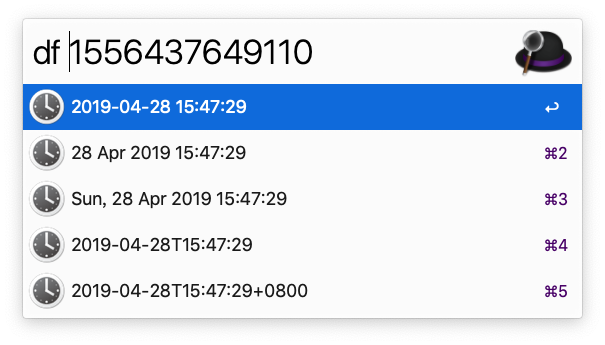

================================

Forked from [mwaterfall](https://github.com/mwaterfall/alfred-datetime-format-converter)

Change:

1. Based on Alfred 3
2. Use local timezone,thanks to [colinfrei](https://gist.github.com/colinfrei/ed0b34d2026092297456cceae5674977)
3. Support timestamp in milliseconds
4. Fix some bugs

Usage:
1. Make sure you have install the Alfred 3
2. [Download The Workflow](https://github.com/ACBingo/alfred-datetime-format-converter/blob/master/download/Datetime%20Format%20Converter.alfredworkflow)
3. Double cilck the **Datetime Format Converter.alfredworkflow** file
4. Open Alfred 3,input keyword '**df**'

[Alfred Forum Topic](http://www.alfredforum.com/topic/1558-datetime-format-converter-convert-between-unix-timestamps-and-datetime-strings/)

alfred-datetime-format-converter
================================

Alfred 2 workflow for converting between timestamps and formatted datetime strings with ease.

Simply type "df" followed by: "now", a UTC unix timestamp, or a formatted datetime string.

This will present you with the parsed date in various formats ready to copy to your clipboard.

